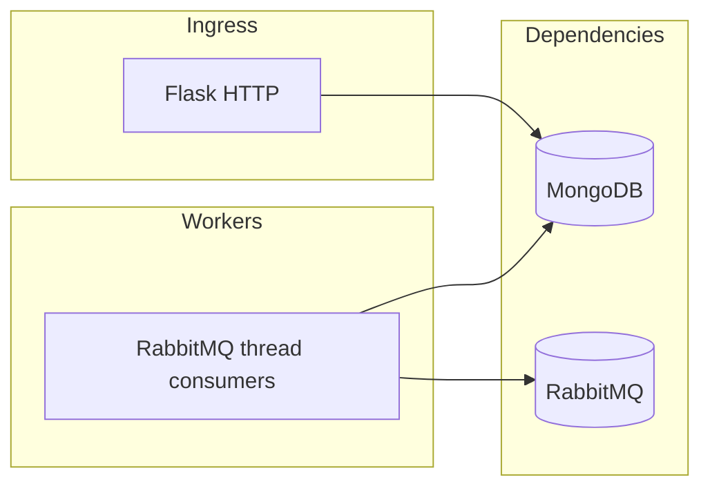

# Banking Notification Service

This service records outbound banking notifications in MongoDB, exposes a small HTTP API for reads and internal dispatch, consumes **topic** events from RabbitMQ (**`banking.events`** with routing key **`txn.created`**, and **`banking.domain`** with routing key **`account.status.changed`**) for high-value transactions and account status changes, and exposes Prometheus metrics and structured JSON logs with PII masking.

## Context and stack

- Python 3.12, Flask, PyMongo, pika, structlog, prometheus-client, flasgger
- MongoDB 7 (database `notification_db`, collection `notifications_log`)
- RabbitMQ (topic exchanges `banking.events` and `banking.domain`, bound as documented below)

## Prerequisites

- Python 3.12
- MongoDB 7 reachable via `MONGODB_URL` or host or user or password fields (see Configuration)
- RabbitMQ reachable via `RABBITMQ_URL` or host or user or password fields
- Optional: Docker for container builds

## Quick start

```bash
cd banking-notification-service
python3.12 -m venv .venv
source .venv/bin/activate
pip install -r requirements.txt
cp .env.example .env
```

Edit `.env` with valid MongoDB and RabbitMQ endpoints, then:

```bash
export $(grep -v '^#' .env | xargs)
python -m src.main
```

Service listens on `PORT` (default 8004). OpenAPI UI: `http://localhost:8004/apidocs/`.

### Tests

```bash
pip install -r requirements.txt
python -m pytest tests/ --cov=src --cov-report=term-missing
```

### Docker

```bash
docker build -t notification-service:latest .
docker run --rm -p 8004:8004 --env-file .env notification-service:latest
```

## Configuration

| Variable | Purpose |
| --- | --- |
| `MONGODB_URL` | Full MongoDB URI including database name (preferred) |
| `MONGODB_HOST`, `MONGODB_PORT`, `MONGODB_USER`, `MONGODB_PASSWORD`, `MONGODB_DATABASE` | Used to build a URI when `MONGODB_URL` is unset |
| `RABBITMQ_URL` | Full AMQP URI (preferred) |
| `RABBITMQ_HOST`, `RABBITMQ_PORT`, `RABBITMQ_USER`, `RABBITMQ_PASSWORD` | Used when `RABBITMQ_URL` is unset |
| `HIGH_VALUE_THRESHOLD` | INR threshold for transaction alerts (default 50000) |
| `MAX_RETRY_COUNT` | Delivery retries after failure (default 3) |
| `PORT` | HTTP port (default 8004) |
| `LOG_LEVEL` | Stdlib logging level name |
| `SERVICE_VERSION` | Reported in `/health` |
| `ENABLE_RABBIT_CONSUMER` | `true` or `false` to start embedded consumers |
| `ENABLE_HSTS` | Set to `true` behind TLS terminators only |

Credentials must always come from the environment or a secret manager; never commit real secrets.

## Architecture



Layers: `presentation` (routes, OpenAPI specs), `application` (services, DTOs, consumer handlers), `domain` (models, enums), `infrastructure` (MongoDB, RabbitMQ, mock senders, metrics).

## API overview

| Method | Path | Description |
| --- | --- | --- |
| GET | `/api/v1/notifications` | Paginated list (`limit` 1 to 100, default 20; `offset` default 0). Response: `data`, `total`, `limit`, `offset`. |
| GET | `/api/v1/notifications/{id}` | UUID v4 notification id |
| POST | `/internal/notifications/send` | Internal trigger: JSON body with `recipient_email`, `recipient_phone`, `channel`, `event_type`, `payload` |
| GET | `/health` | `status`, `service`, `version`, `dependencies.mongodb`, `dependencies.rabbitmq`; HTTP 503 if a dependency check fails |
| GET | `/metrics` | Prometheus text format; counters `notifications_sent_total` and `notifications_failed_total` labelled by `channel` and `event_type` |

Validation and unexpected failures return RFC 7807 `application/problem+json` with generic `detail` text.

Incoming requests may send `X-Correlation-ID`; the same value is echoed on responses and attached to structured logs.

## RabbitMQ consumers

A background thread declares topology, binds queues, and consumes:

| Queue | Exchange | Type | Routing key | Behaviour |
| --- | --- | --- | --- | --- |
| `txn.created.notifications` | `banking.events` | topic | `txn.created` | Parses JSON; if `amount` exceeds `HIGH_VALUE_THRESHOLD` (INR), creates a `TRANSACTION_ALERT` email notification. Optional `customer_email` and `customer_phone` fields should be present for successful delivery. |
| `account.status.notifications` | `banking.domain` | topic | `account.status.changed` | Creates an `ACCOUNT_STATUS_CHANGE` notification; prefers email when `customer_email` is set, otherwise SMS when `customer_phone` is set. |

Malformed JSON is acknowledged without requeue to avoid poison-message loops; handler exceptions negative-ack without requeue.

## Kubernetes

Manifests under `k8s/` define a single-replica Deployment (probes on `/health`, CPU or memory limits as specified), ClusterIP Service on port 8004, ConfigMap for non-secret settings, and Secret placeholders for passwords. The application builds MongoDB and RabbitMQ connection settings from discrete env vars when full URLs are not provided.

## Common issues

- **Health 503**: MongoDB or RabbitMQ unreachable from the pod or laptop; verify URIs, credentials, and network policy.
- **Consumers idle**: Ensure exchanges and queues exist or let the process declare them; confirm `ENABLE_RABBIT_CONSUMER=true`.
- **OpenAPI or import errors**: Use Python 3.12; `jsonschema` is pinned to `<4.18` for compatibility with `flasgger` in some environments.

## Dependency note

`jsonschema` is constrained to versions below 4.18 to avoid optional native wheels that can break mixed-architecture developer machines while keeping `flasgger` functional.
